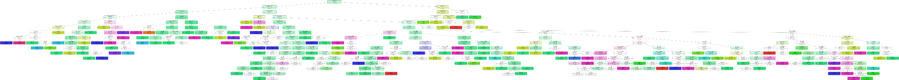

# MLEARN

A simple machine learning algorithm in python, trained to predict recommended music genre based on age and gender.

## Deployment

To deploy this project import "mlearn.ipynb" to jupyter notebook

For native deployment:
```
  python3 mlearn.py
```

## Dependencies
```
  pandas
  scikit-learn
  joblib
```
Simply run:
```
  pip install -r requirements.txt
```
## Data Visualization

Model with 75% Accuracy Score

